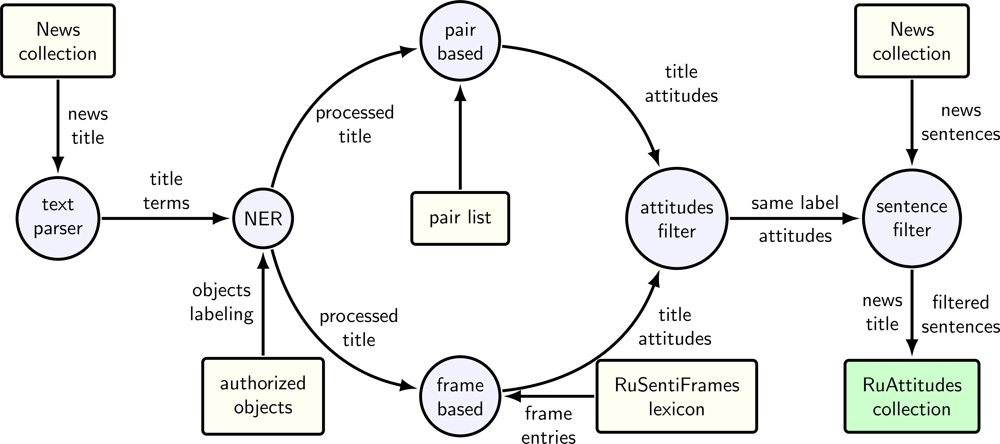

# Frame-Based Attitude Extraction Workflow

A source code for a core of news processing workflow.
It provides scripts for sentiment attitude extraction using frame-based method.




## Dependencies

* python == 3.6
* sqlite3
* arekit == [0.19.5](https://github.com/nicolay-r/AREkit/tree/0.19.5-bdr-elsevier-2020-py3)
    * Utilized as a core library for text parsing, frames reading, stemming application, etc.
* ner == 0.0.2 
    * Optional, for `deep-ner` NER model
* deep-pavlov == 1.11.0 
    * Optional, for `bert-mult-ontonotes` NER model
    
## Resources
* [RuWordNet](https://ruwordnet.ru/en/) [Contact with authors to download]
* [RuSentiFrames-2.0](https://github.com/nicolay-r/RuSentiFrames)

# Installation

* Step 1: Install dependencies.
``` bash
# Install AREkit dependency
git clone --single-branch --branch 0.19.5-bdr-elsevier-2020-py3 git@github.com:nicolay-r/AREkit.git core

# Download python dependencies
pip install -r requirements.txt
```
* Step 2: Download `rusentiframes-20.json` lexicon:
```bash
cd data && ./download.sh
```
    
# Usage 

Considered to run scripts which organized in the related [folder](scripts) as follows:
* **Step 1.** `cache`  -- for caching extracted from document data into sqlite tables:
    * NER cache [[readme]](scripts/cache/ner/README.md);
    * Frames cache [PROVIDE TUTORIAL];
* **Step 2.** Gather synonyms collection:
    1. Extracting object values;
    2. Grouping into single synonyms collection.
```
pushd .
cd ../scripts/synonyms/

python3 -u syn_0_extract_obj_values.py \
		--ner-type ontonotes-bert-mult --output-dir ./.vocab \
		--ner-cache-filepath <NER_CACHE_SQLITE3_DB> \
		--source-dir <SOURCE_DIR>

python3 -u syn_1_compose_collection.py \
		--ru-thes-nouns <THESAURUS_FOLDER>/synsets.N.xml \
		--obj-values-dir .vocab/ \
		--output-dir <OUTPUT_DIR>
popd
```
* **Step 3.** Apply `re`script with `--task ext_by_frames` 
    * is a stage 1. of the workflow (pair list gathering):
```bash
pushd .
cd ../scripts/re/
python3 -u scripts/re/run.py \
	--task ext_by_frames \
	--use-ner-cache-only \
	--ner-type ontonotes-bert-mult \
	--ner-cache-filepath <PATH_TO_SQLITE3_DB> \
	--frames-cache-dir <FOLDER_THAT_CONTAINS_SQLITE3_DB> \  
	--synonyms <SYNONYMS_COLLECTION> \
	--rusentiframes ../../data/rusentiframes-20.json \
	--output-dir <OUTPUT_DIR> \
	--source-dir <SOURCE_COLLECTION_DIR>
popd
```
* **Step 4.** Filter most relevant pairs from pair list:
```
pushd .
cd ../scripts/re_post/
python3 -u filter_stat.py --min-bound 0.65 --min-count 25 \
     --stat-file <OUTPUT_DIR>/ext_by_frames/stat.txt \
     --synonyms <SYNONYMS_COLECTION> \
     --fast
popd
```
* **Step 5.** Apply `re` script with `--task ext_diff` 
    * is a stage 2. of the workflow:
```
pushd .
cd ../scripts/re/
python3 -u run.py \
	--task ext_diff \
	--use-ner-cache-only \
	--ner-type ontonotes-bert-mult \
	--diff-pairs-list <OUTPUT_DIR>/ext_by_frames/25-0.65-stat.txt \
	--ner-cache-filepath <PATH_TO_SQLITE3_DB> \
	--frames-cache-dir <FOLDER_THAT_CONTAINS_SQLITE3_DB> \  
	--parse-frames-in-sentences \
	--synonyms <SYNONYMS_COLLECTION> \
	--output-dir <OUTPUT_DIR> \
	--source-dir <SOURCE_DIR> 
popd
```
    
## Default News Reader

Please refer to the [simple news reader](texts/readers/simple.py):
* Reading from a single file;
* Documents separation via `\n`;
* Every sentence at new line, where first one is a title.

> TODO#1. Provide example and simple reader.

## References
> To be added.
