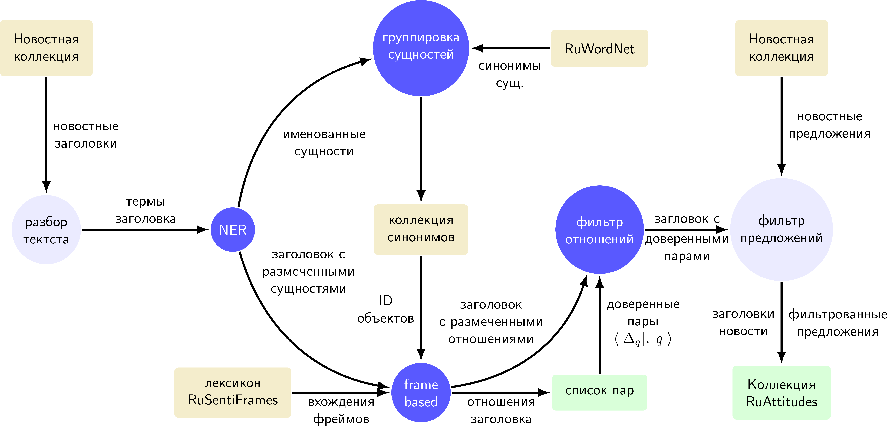

# Frame-Based Attitude Extraction Workflow

Represents a workflow, which was applied towards news collection in order to complete
[RuAttitudes-1.0](https://github.com/nicolay-r/RuAttitudes/tree/v1.2) training set.


> Frame-Based and Pair-Based attitude extraction workflow, version 1.0

* Distant Supervision for Sentiment Attitude Extraction
[[paper-ranlp-proceeding]](http://lml.bas.bg/ranlp2019/proceedings-ranlp-2019.pdf),
[[poster]](docs/ranlp_2019_poster_portrait.pdf)
    * Rusnachenko Nicolay, Loukachevitch Natalia, Tutubalina Elena
    * RANLP-2019
    

## References

```
@article{rusnachenko2019distant,
  title={Distant Supervision for Sentiment Attitude Extraction},
  author={Rusnachenko, Nicolay and Loukachevitch, Natalia and Tutubalina, Elena},
  booktitle={RANLP},
  year={2019}
}
```